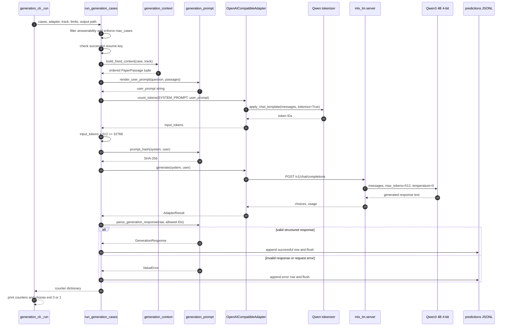
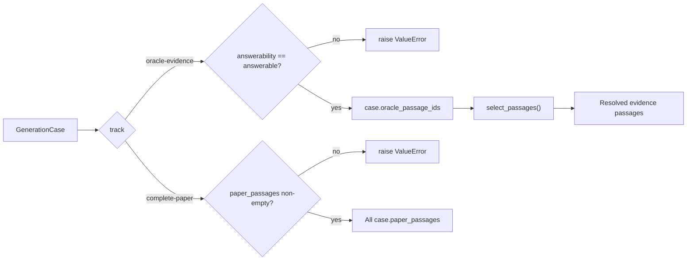
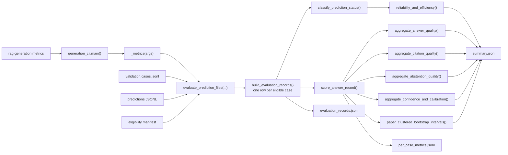

# Generation Smoke Test Execution Flow

This document traces the current `rag-generation run` implementation from the
shell command through QASPER case loading, prompt construction, local Qwen
inference, validation, persistence, and process exit.

It describes the runner and the implemented Stage 0 to 5 deterministic metric
layers. Judge and bootstrap layers remain future work.

## 1. Processes and prerequisites

The smoke test uses two processes:

1. `mlx_lm.server` owns the model and exposes a local chat-completions endpoint.
2. `rag-generation run` owns the benchmark cases, prompt construction, validation,
   and JSONL output.

Start the model server first:

```bash
mlx_lm.server --model mlx-community/Qwen3-4B-Instruct-2507-4bit
```

Then start the smoke test in a second terminal:

```bash
rag-generation run \
  --track oracle-evidence \
  --max-cases 25 \
  --max-context-tokens 32768 \
  --max-output-tokens 512
```

The benchmark runner does not start, stop, or supervise `mlx_lm.server`.

## 2. End-to-end flowchart

```mermaid
flowchart TD
    Shell["Shell: rag-generation run"]
    Entry["Console entry point<br/>rag_eval.generation_cli:main"]
    Parser["build_parser()<br/>construct run subcommand defaults"]
    Dispatch["main(argv)<br/>parse args and call args.handler(args)"]
    Run["_run(args)"]

    CasesFile["validation.cases.jsonl"]
    Decode["json.loads(line)"]
    Rebuild["generation_case_from_dict(payload)"]
    Cases["list[GenerationCase]"]

    AdapterInit["OpenAICompatibleAdapter(...)"]
    Tokenizer["AutoTokenizer.from_pretrained<br/>Qwen/Qwen3-4B-Instruct-2507"]
    Adapter["Configured adapter"]

    Runner["run_generation_cases(...)"]
    Resume["_completed_keys(output_file)"]
    Existing["Existing prediction JSONL"]
    Loop{"Next eligible case?"}
    Filter{"Track and answerability filter"}
    Limit{"Selected count below max_cases?"}
    DoneKey{"Successful case/track/model<br/>already persisted?"}

    Context["build_fixed_context(case, track)"]
    Select["select_passages(case, oracle IDs)"]
    Passages["tuple[PaperPassage, ...]"]
    Render["render_user_prompt(question, passages)"]
    UserPrompt["Serialized context and question"]
    Count["adapter.count_tokens(system, user)"]
    ChatTemplate["tokenizer.apply_chat_template(...)"]
    TokenCount["input_tokens: int"]
    Fit{"input_tokens + 512 <= 32768?"}

    Hash["prompt_hash(system, user)"]
    Row["Initialize prediction row"]
    Generate["adapter.generate(system, user)"]
    Request["POST /v1/chat/completions"]
    Server["mlx_lm.server"]
    Model["Qwen3-4B-Instruct-2507 4-bit"]
    ServerJSON["Chat-completions JSON"]
    Result["AdapterResult"]

    Parse["parse_generation_response(raw, allowed IDs)"]
    Valid{"Strict response valid?"}
    Parsed["GenerationResponse"]
    Success["Add parsed_response and error=null"]
    Error["Add parsed_response=null and error message"]
    Persist["Append one JSON line and flush"]
    Counts["Update run counters"]
    Summary["Print counters as JSON"]
    Exit{"errors > 0?"}
    Exit0["Process exit 0"]
    Exit1["Process exit 1"]

    Shell --> Entry --> Dispatch
    Dispatch --> Parser
    Parser --> Dispatch
    Dispatch --> Run

    CasesFile --> Run
    Run --> Decode --> Rebuild --> Cases
    Run --> AdapterInit
    AdapterInit --> Tokenizer
    Tokenizer --> Adapter
    Cases --> Runner
    Adapter --> Runner

    Existing --> Resume
    Runner --> Resume --> Loop
    Loop -->|case| Filter
    Filter -->|excluded| Loop
    Filter -->|included| Limit
    Limit -->|limit reached| Summary
    Limit -->|continue| DoneKey
    DoneKey -->|already successful| Counts --> Loop
    DoneKey -->|new or prior error| Context

    Context -->|oracle-evidence| Select --> Passages
    Context -->|complete-paper| Passages
    Passages --> Render --> UserPrompt
    UserPrompt --> Count --> ChatTemplate --> TokenCount --> Fit
    Fit -->|no| Counts --> Loop
    Fit -->|yes| Hash --> Row --> Generate

    Generate --> Request --> Server --> Model --> ServerJSON --> Result
    Result --> Parse --> Valid
    Valid -->|yes| Parsed --> Success --> Persist
    Valid -->|no| Error --> Persist
    Generate -->|request or server error| Error
    Persist --> Counts --> Loop

    Loop -->|no more cases| Summary --> Exit
    Exit -->|no errors| Exit0
    Exit -->|one or more errors| Exit1
```



## 3. Invocation and parameter flow

The installed console command is declared in
[`pyproject.toml`](pyproject.toml):

```toml
[project.scripts]
rag-generation = "rag_eval.generation_cli:main"
```

This means the shell command invokes:

```python
rag_eval.generation_cli.main()
```

### Default `run` parameters

| CLI parameter | Default value | Consumed by |
|---|---:|---|
| `--cases-file` | `data/generation/qasper-v1/validation.cases.jsonl` | `_run()` |
| `--track` | `oracle-evidence` | `run_generation_cases()` and `build_fixed_context()` |
| `--output-file` | `results/generation/qasper-v1/predictions/qwen3-4b-track-b-v1.jsonl` | `run_generation_cases()` |
| `--base-url` | `http://127.0.0.1:8080/v1` | `OpenAICompatibleAdapter` |
| `--model` | `mlx-community/Qwen3-4B-Instruct-2507-4bit` | Adapter request and resume key |
| `--tokenizer` | `Qwen/Qwen3-4B-Instruct-2507` | `AutoTokenizer.from_pretrained()` |
| `--max-context-tokens` | `32768` | `run_generation_cases()` eligibility check |
| `--max-output-tokens` | `512` | Eligibility check and HTTP `max_tokens` |
| `--max-cases` | `25` | `run_generation_cases()` loop limit |
| `--temperature` | `0.0` | HTTP request payload |
| `--timeout` | `300.0` seconds | `urllib.request.urlopen()` |
| `--retries` | `1` | Adapter request loop |
| `--no-resume` | absent, so resume is `True` | Output open mode and `_completed_keys()` |

## 4. Function-to-function handoff

| Step | Function | Important inputs | Output | Output consumer |
|---:|---|---|---|---|
| 1 | `main(argv=None)` | Shell arguments | Integer exit status | Console-script wrapper |
| 2 | `build_parser()` | None | Configured `ArgumentParser` | `main()` |
| 3 | `ArgumentParser.parse_args()` | `run` arguments | `argparse.Namespace` | `main()` |
| 4 | `_run(args)` | Parsed namespace | `0` or `1` | `main()` |
| 5 | `json.loads(line)` | One cases-file line | Python mapping | `generation_case_from_dict()` |
| 6 | `generation_case_from_dict(payload)` | Normalized case mapping | `GenerationCase` | `_run()` case list |
| 7 | `OpenAICompatibleAdapter(...)` | URL, model, tokenizer, decoding controls | Configured adapter | `run_generation_cases()` |
| 8 | `AutoTokenizer.from_pretrained()` | Original Qwen tokenizer ID | Hugging Face tokenizer | Adapter token counting |
| 9 | `run_generation_cases(...)` | Cases, adapter, track, paths, limits | Counter dictionary | `_run()` |
| 10 | `_completed_keys(path)` | Existing predictions path | Successful resume-key set | Runner loop |
| 11 | `build_fixed_context(case, track)` | One case and track | Ordered passage tuple | `render_user_prompt()` |
| 12 | `select_passages(case, IDs)` | Case and oracle evidence IDs | Evidence passages in document order | `build_fixed_context()` |
| 13 | `render_user_prompt()` | Question and passages | User-prompt string | Token counter, prompt hash, generator |
| 14 | `adapter.count_tokens()` | System and user prompts | Integer input-token count | Context eligibility check |
| 15 | `tokenizer.apply_chat_template()` | Two chat messages | Token IDs | `adapter.count_tokens()` |
| 16 | `prompt_hash()` | Exact system and user prompts | SHA-256 string | Prediction row |
| 17 | `adapter.generate()` | System and user prompts | `AdapterResult` | Runner result handling |
| 18 | `urllib.request.urlopen()` | HTTP request and timeout | HTTP response bytes | Adapter JSON decoder |
| 19 | `mlx_lm.server` | Chat-completions payload | Chat-completions JSON | Adapter |
| 20 | `parse_generation_response()` | Raw text and allowed passage IDs | `GenerationResponse` or `ValueError` | Runner success/error branch |
| 21 | `json.dumps(row)` | Completed or failed prediction row | One JSON string | Output-file append |
| 22 | `print(json.dumps(counts))` | Final counters | Terminal summary | User or calling process |

## 5. Per-case sequence diagram



## 6. Context construction

`build_fixed_context()` has two branches:



The default smoke test uses `oracle-evidence`. Before context construction, the
runner excludes every case whose `answerability` is not `answerable`.

For `complete-paper`, the runner excludes `ambiguous` cases and keeps unanimous
answerable and unanimous unanswerable cases.

No retriever, embedding model, BM25 search, hybrid fusion, or reranker is called.

## 7. Prompt construction

The frozen prompt contract is `qasper-generation-v2`, exposed through
`PROMPT_VERSION` and `SYSTEM_PROMPT` from
[`prompt.py`](src/rag_eval/generation/prompt.py).

`render_user_prompt()` serializes the selected passages as:

```text
Context:
[<passage_id>]
<passage_text>

[<next_passage_id>]
<next_passage_text>

Question:
<question>

Response contract reminder:
<exact JSON types, numeric confidence, abstention rules, and citation rules>
```

The exact system and user strings have two consumers:

1. `adapter.count_tokens()` decides whether the case fits the shared budget.
2. `adapter.generate()` sends the same strings to the model server.

`prompt_hash()` also consumes both strings and stores their deterministic SHA-256
in the prediction row. The prediction and eligibility manifest also store
`prompt_version`, and resume identity includes it.

## 8. Token eligibility

The runner calls:

```python
adapter.count_tokens(SYSTEM_PROMPT, user_prompt)
```

The adapter applies the original Qwen chat template with:

```python
tokenizer.apply_chat_template(
    messages,
    add_generation_prompt=True,
    tokenize=True,
)
```

The case is eligible only when:

```text
input_tokens + max_output_tokens <= max_context_tokens
```

With smoke-test defaults:

```text
input_tokens + 512 <= 32768
```

An ineligible case increments `ineligible` and is not sent to Qwen. The runner
does not write a prediction row for it, but records eligibility IDs and exclusion
counts in the prediction file's `.eligibility.json` sidecar.

## 9. HTTP request and retry flow

`OpenAICompatibleAdapter.generate()` creates this payload:

```json
{
  "model": "mlx-community/Qwen3-4B-Instruct-2507-4bit",
  "messages": [
    {"role": "system", "content": "<SYSTEM_PROMPT>"},
    {"role": "user", "content": "<rendered user prompt>"}
  ],
  "max_tokens": 512,
  "temperature": 0.0,
  "stream": false
}
```

It posts the payload to:

```text
http://127.0.0.1:8080/v1/chat/completions
```

With `--retries 1`, the adapter can make at most two attempts. It retries these
failures:

- URL or connection errors
- timeouts
- invalid JSON in the HTTP response

It does not retry a structurally unexpected but valid JSON response. The returned
`AdapterResult` contains:

| Field | Producer | Consumer |
|---|---|---|
| `text` | `choices[0].message.content` | Strict response parser and raw output row |
| `latency_seconds` | Adapter wall-clock timer | Prediction row |
| `input_tokens` | Server `usage.prompt_tokens` | Prediction row |
| `output_tokens` | Server `usage.completion_tokens` | Prediction row |
| `attempts` | Adapter retry loop | Prediction row |

## 10. Strict response validation

The model must return exactly one JSON object:

```json
{
  "answer": "string",
  "abstain": false,
  "citations": ["paper-id::paragraph::0001"],
  "confidence": 0.9
}
```

`parse_generation_response()` enforces:

- exactly four keys: `answer`, `abstain`, `citations`, and `confidence`
- correct value types
- confidence in the inclusive range `[0, 1]`
- answer length of at most 120 words and no more than 5 citations
- every citation exists in the context supplied to this case
- an abstention has an empty answer and no citations
- a non-abstention has non-empty answer text and at least one citation

Its successful output is a `GenerationResponse`. Its failure output is a
`ValueError`, which the runner records as an error row.

## 11. Prediction output

Each attempted model call appends and flushes one row to:

```text
results/generation/qasper-v1/predictions/qwen3-4b-smoke.jsonl
```

### Successful row

```json
{
  "case_id": "...",
  "paper_id": "...",
  "split": "validation",
  "track": "oracle-evidence",
  "model_id": "mlx-community/Qwen3-4B-Instruct-2507-4bit",
  "answerability": "answerable",
  "context_passage_ids": ["..."],
  "prompt_version": "qasper-generation-v2",
  "prompt_hash": "...",
  "counted_input_tokens": 1234,
  "raw_response": "{...}",
  "parsed_response": {
    "answer": "...",
    "abstain": false,
    "citations": ["..."],
    "confidence": 0.9
  },
  "latency_seconds": 1.23,
  "server_input_tokens": 1234,
  "server_output_tokens": 42,
  "attempts": 1,
  "error": null
}
```

### Error row

If generation succeeds but strict parsing fails, the row retains the raw response
and timing, but stores:

```json
{
  "parsed_response": null,
  "error": "validation error message"
}
```

If the HTTP request itself fails, no raw response or server token counts exist.
The row still contains the case metadata, context IDs, prompt hash, counted input
tokens, `parsed_response: null`, and the error message.

## 12. Resume behavior

When resume is enabled, `_completed_keys()` reads the existing output and builds
keys with this shape:

```text
(case_id, track, model_id)
```

Only rows whose `error` is `null` count as completed. Therefore:

- a successful row is skipped on the next run
- an error row is attempted again
- changing the track creates a different key
- changing the model creates a different key

`--no-resume` opens the output file in write mode and replaces its prior contents.

## 13. Final counters and process exit

`run_generation_cases()` returns:

```json
{
  "selected": 25,
  "completed": 24,
  "skipped": 0,
  "ineligible": 0,
  "errors": 1
}
```

The counter dictionary is consumed by `_run()`:

1. It is printed to the terminal as formatted JSON.
2. `_run()` returns exit code `1` when `errors > 0`.
3. `_run()` returns exit code `0` when `errors == 0`.

The console-script wrapper consumes that integer as the process exit status.

## 14. Important current boundaries

- The runner assumes `mlx_lm.server` is already running.
- The model weights are loaded and retained by the server, not the benchmark process.
- Processing is sequential. Concurrency is one.
- Retrieval is bypassed entirely.
- Context eligibility is computed before model execution and persisted as a sidecar.
- A resumed run fails if its eligibility manifest would change.
- Context construction and token-count failures occur before the per-call error
  handler and currently stop the run.
- The evaluator computes QASPER token F1, normalized exact match, citation evidence
  overlap, Track B abstention and calibration, paper-clustered confidence
  intervals, reliability, latency, and token summaries. Judge scores remain future work.

## 15. Source map

| Responsibility | Source |
|---|---|
| Console entry point | [`pyproject.toml`](pyproject.toml) |
| CLI parsing and dispatch | [`src/rag_eval/generation_cli.py`](src/rag_eval/generation_cli.py) |
| Persisted case reconstruction | [`src/rag_eval/generation/data.py`](src/rag_eval/generation/data.py) |
| Track-specific context | [`src/rag_eval/generation/context.py`](src/rag_eval/generation/context.py) |
| Prompt rendering, hash, and validation | [`src/rag_eval/generation/prompt.py`](src/rag_eval/generation/prompt.py) |
| Local HTTP and tokenizer adapter | [`src/rag_eval/generation/adapter.py`](src/rag_eval/generation/adapter.py) |
| Case loop, eligibility, persistence, resume | [`src/rag_eval/generation/runner.py`](src/rag_eval/generation/runner.py) |
| Deterministic generation metrics | [`src/rag_eval/generation/metrics.py`](src/rag_eval/generation/metrics.py) |
| Retrieved-context and retrieve-then-generate orchestration | [`src/rag_eval/end_to_end/workflow.py`](src/rag_eval/end_to_end/workflow.py) |
| Retrieval-versus-generation failure attribution | [`src/rag_eval/end_to_end/attribution.py`](src/rag_eval/end_to_end/attribution.py) |
| Smoke-test command | [`README.md`](README.md) |

## 16. Stage 0 to 6 metric execution

Run metrics only after `rag-generation run` has created both the prediction JSONL
and its eligibility sidecar:

```bash
rag-generation metrics
```



The evaluator takes these steps:

1. Load normalized cases and the frozen eligible case IDs.
2. Filter predictions to the requested track and model.
3. Join by `case_id`. If retries produced multiple rows, use the last row and
   record the duplicate count.
4. Create a record for every eligible case. Missing predictions are explicit
   `missing_prediction` records.
5. Classify valid responses, invalid JSON, invalid schema, invalid citations,
   request errors, and timeouts.
6. Aggregate status rates, retry rate, latency, server token usage, total tokens,
   and the local-inference cost basis.
7. Convert abstentions to QASPER's `Unanswerable` label, normalize candidate and
   reference text, calculate token F1 and normalized exact match against every
   annotation, and retain the best score per case.
8. Compare citations with every non-empty annotation evidence set, retain the best
   citation-F1 match, and report unscorable evidence cases separately.
9. On complete-paper runs, compare the unanimous answerability label with the
   declared abstention, report invalid outputs as no decisions, and keep ambiguous
   cases outside primary binary metrics.
10. On complete-paper runs, pair declared confidence with correct abstention,
    false-decision quality, or continuous answer token F1. Report confidence
    availability, ten-bin expected calibration error, and a tie-grouped
    risk-coverage curve with its discrete area.
11. Resample whole papers 10,000 times with fixed seed `42`, recompute applicable
    quality aggregates, and attach two-sided 95 percent percentile intervals.
12. Write evaluation records, per-case scores, and the aggregate summary.

Invalid and missing predictions receive zero answer quality. They remain in the
eligible-case denominator, which prevents failed calls from inflating the score.
